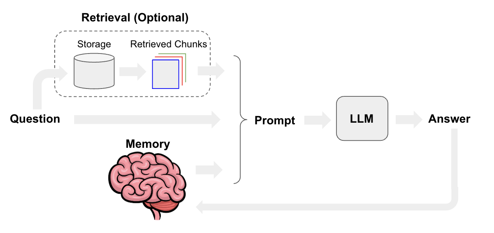

# Medic-BOT using LLAMA2 
The **Medic Bot** is a repository for a medical chatbot that uses the Llama-2-7B-Chat-GGML model and the pdf _The Gale Encyclopedia of Medicine_. The chatbot has the potential to be a valuable tool for patients, healthcare professionals, and researchers. The chatbot can be used to answer questions about medical topics, provide summaries of medical articles, and generate medical text. However, it is important to note that the chatbot is not a substitute for medical advice from a qualified healthcare professional.

## Architecture


## Features of the Medic-Bot:

 - It uses the _Llama-2-7B-Chat-GGML_ model, which is a **large language model (LLM)** that has been fine-tuned.
   * Name - **llama-2-7b-chat.ggmlv3.q2_K.bin**
   * Quant method - q2_K
   * Bits - 2
   * Size - **2.87 GB**
   * Max RAM required - 5.37 GB
   * Use case - New k-quant method. Uses GGML_TYPE_Q4_K for the attention.vw and feed_forward.w2 tensors, GGML_TYPE_Q2_K for the other tensors.
   * **Model:** Know more about model **[Llama-2-7B-Chat-GGML](https://huggingface.co/TheBloke/Llama-2-7B-Chat-GGML)**
 - It is trained on the pdf **[The Gale Encyclopedia of Medicine, Volume 1, 2nd Edition, 637-page PDF](https://github.com/ThisIs-Developer/Llama-2-GGML-Medical-Chatbot/blob/main/data/71763-gale-encyclopedia-of-medicine.-vol.-1.-2nd-ed.pdf)**, which is a comprehensive medical reference that provides information on a wide range of medical topics. This means that the chatbot is able to answer questions about a variety of medical topics.

## Usage
1. Open Git Bash.
2. Change the current working directory to the location where you want the cloned directory.
3. Type `git clone`, and then paste the URL you copied earlier.
```bash
   git clone https://github.com/Krishnann-s/Medicbot-using-Llama2.git
```
4. Install the pip packages in requirements.txt
 ```bash
   pip install -r requirements.txt
 ```
5. Now run it!
```terminal
   chainlit run model.py -w
```
## ChatBot Conversations
### MedicBot 
 


## 📌 Important Notes

- While powerful, this chatbot isn't a substitute for professional medical advice.
## Contributors
[Krishnan S](https://github.com/Krishnann-s) 
[Naveen Kumar K](https://github.com/KALLUMATAM-NAVEEN-KUMAR) 
[Puneeth Kumar Reddy](https://github.com/Puneeth207)

## 📄 License

This project is licensed under the [MIT License](https://github.com/Krishnann-s/Medicbot-using-Llama2/blob/main/LICENSE).
